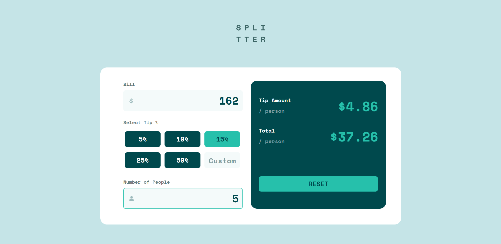

# Frontend Mentor - Tip calculator app solution

This is a solution to the [Tip calculator app challenge on Frontend Mentor](https://www.frontendmentor.io/challenges/tip-calculator-app-ugJNGbJUX). Frontend Mentor challenges help you improve your coding skills by building realistic projects.

## Table of contents

- [Overview](#overview)
  - [The challenge](#the-challenge)
  - [Screenshot](#screenshot)
  - [Links](#links)
- [My process](#my-process)
  - [Built with](#built-with)
  - [What I learned](#what-i-learned)
  - [Useful resources](#useful-resources)
- [Author](#author)


## Overview

### The challenge

Users should be able to:

- View the optimal layout for the app depending on their device's screen size
- See hover states for all interactive elements on the page
- Calculate the correct tip and total cost of the bill per person

### Screenshot




### Links

- Solution URL: [here](https://www.frontendmentor.io/solutions/tip-calculator-app-with-bootstrap-scss-lfV_3Gyc6y)
- Live Site URL: [here](https://hnvkhanh.github.io/tip-calculator-app-main/)

## My process

### Built with

- Semantic HTML5 markup
- CSS custom properties
- CSS Grid
- Mobile-first workflow
- Vanilla JavaScript
- [Bootstrap v5.2](https://getbootstrap.com/docs/5.2/getting-started/introduction/)


### What I learned

This is the first time that I try to build a website with mobile-first workflow, I have to say it way easier to work with. Esspecially, we can utilize Bootstrap better with this workflow.
Thanks to this project I have had a better understanding of Bootstrap grid properties.
Also, I learned some new code in JavaScript:

- JavaScript Number `toFixed( )` Method: use this to work with floating point.
- A way to reload a webpage:

```js
location.reload();
```

### Useful resources

- [Window location.reload()](https://www.w3schools.com/jsref/met_loc_reload.asp)
- [JavaScript Number toFixed( ) Method](https://www.geeksforgeeks.org/javascript-tofixed-function/)


## Author

- Frontend Mentor - [@hnvkhanh](https://www.frontendmentor.io/profile/hnvkhanh)


